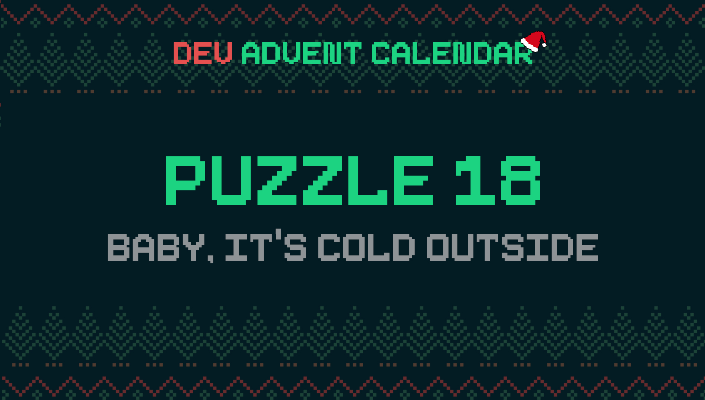

ℹ️ For detailed information about the contest, check out [devadvent/readme](https://github.com/devadvent/readme/)

# Dev Advent Calendar 🎅 Puzzle 17 - Baby, It's Cold Outside ❄️

Santa visits all corners of the world, and in some it is colder than others. He has to be careful to put on the proper gear on the reindeers to visit certain areas.
However, this doesn't depend on the outside temperature, but the "perceived" temperature, also known as _windchill_.

You probably know this phenomenon - It says that it's 0°C outside, but it feels a lot colder. A significant factor is the wind speed.

Let's help implement a new value in the dashboard on Santa's sleigh for "perceived temperature".

## 🧩 The puzzle

Santa's sleigh has already built-in sensors for temperature and wind speed (yes, already calculated of the outside windspeed and the speed he is flying at).

A helpful elf sent you this link that might be helpful figuring out how to calculate windchill: [https://sciencing.com/relative-humidity-7611453.html](https://sciencing.com/relative-humidity-7611453.html)

Your job is it to complete the function `calculateWindchill` in the file [src/utils/windchill.js](src/utils/windchill.js).
The function takes 3 arguments:

-   `temperature`: Current temperature
-   `windSpeed`: Current wind speed
-   `units`: Which unit system we use: `US` for Fahrenheit and miles per hour (mph), `undefined` for Celsius and kilometers per hour (km/h)

The function should return the approximate perceived temperature. This should also work correct with US units.

ℹ️ When using US-units, also return the value as Fahrenheit
ℹ️ Results should be [rounded](https://developer.mozilla.org/en-US/docs/Web/JavaScript/Reference/Global_Objects/Math/round)

## 🚢 Ship your solution

Check out the [contributing guide](https://github.com/devadvent/readme/blob/main/CONTRIBUTING.md) for details about how to participate.

In short:

-   ✨ Create your repository by [acceping the assignment](https://classroom.github.com/a/0yBI_ZiS) using the participation link
-   🧩 Solve the puzzle
-   🐦 Add your Twitter handle to `twitter.js`
-   🤖 Test your solution
-   🚀 Upload your changes to the `main` branch

## 🔗 Participation link

In order to participate, you need to enter the following link and accept the assignment:
[https://classroom.github.com/a/0yBI_ZiS](https://classroom.github.com/a/0yBI_ZiS)

## 💻 Use this project

### ⏳ Install the dependencies

Install the dependencies with

```bash
yarn install
```

or

```bash
npm install
```

### ⚙️ Run the code

Run the code with

```bash
yarn dev
```

or

```bash
npm run dev
```

### 🤖 Test your solution

This puzzle is equipped with automated tests (in the `./tests` folder). In order for your solution to qualify for winning the daily prize, **all** tests need to pass.

To run these tests, execute one of the following commands in your console:

```bash
yarn test
```

or

```bash
npm test
```
